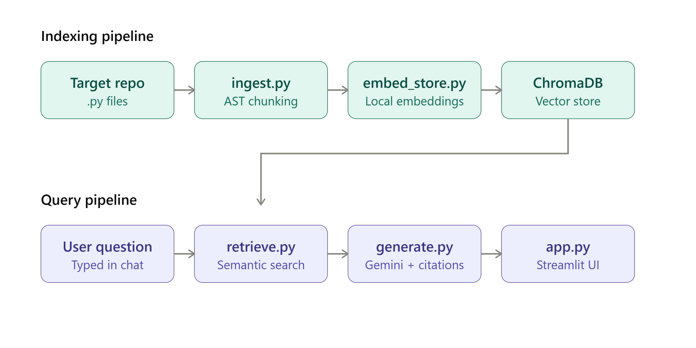

# Codebase Q&A Assistant (RAG)
 
An AI assistant that answers natural-language questions about a code repository — grounded strictly in the actual code, with exact file and line citations for every claim.
 
Built as a portfolio project to demonstrate practical Retrieval-Augmented Generation (RAG): not just wrapping an LLM API, but building a real retrieval pipeline that keeps answers accurate and verifiable.
 
## Why this exists
 
New developers joining an unfamiliar codebase spend significant time just understanding how things fit together. This tool lets you ask plain-English questions — "how does X work," "what happens if Y fails" — and get an answer sourced directly from the code, not from a model's guesswork. Every answer includes the exact file and line numbers it came from, so you can verify it in seconds.
 
## Demo
 
Ask a question like:
> "What happens end-to-end when a known face is detected, from recognition to being logged?"
 
And get back a grounded, multi-file answer with citations like `simple_facerec.py:82-96` and `attendance.py:36-46` — pulled from the actual source, not memorized or hallucinated.
 
## How it works
 
1. **Ingest** — the target repository is walked and every `.py` file is parsed with Python's `ast` module. Instead of splitting code into arbitrary fixed-size text blocks (the naive RAG approach), chunks are extracted at function/class granularity, each carrying its exact file path and line range.
2. **Embed** — each chunk is embedded locally using `sentence-transformers` (`all-MiniLM-L6-v2`) — no API cost, runs entirely on-device.
3. **Store** — embeddings are stored in a persistent ChromaDB vector database.
4. **Retrieve** — on a question, the query is embedded and ChromaDB returns the most semantically similar code chunks.
5. **Generate** — the retrieved chunks are passed to Gemini along with the question, with an explicit instruction to answer *only* from the given context and cite file/line for every claim. If the context doesn't contain the answer, the model is instructed to say so rather than guess.
```
Repo → ingest.py (AST chunking) → embed_store.py (embeddings + ChromaDB)
                                                        │
User question → retrieve.py (semantic search) ←────────┘
                        │
                        ▼
              generate.py (Gemini, grounded + cited)
                        │
                        ▼
                  app.py (Streamlit UI)
```
 

 
## Tech stack (100% free)
 
| Component | Tool | Why |
|---|---|---|
| Code parsing | Python `ast` | Structural chunking (function/class), not naive text splitting |
| Embeddings | `sentence-transformers` (`all-MiniLM-L6-v2`) | Runs locally, no API cost or key needed |
| Vector store | ChromaDB | Free, local, persistent |
| LLM | Google Gemini API (free tier) | Frontier-quality reasoning for accurate code explanations |
| UI | Streamlit | Fast to build, clean chat interface |
 
## Evaluation
 
Rather than claim an accuracy number with no evidence, this project includes a transparent eval set: 15 hand-written questions against a real target repository ([face-recognition-attendance](https://github.com/daniyalahmad45/face-recognition-attendance)), each graded by manual review against the actual source. Full question-by-question results are in [`eval_results.md`](./eval_results.md).
 
**Result: 14/15 correct (93%), 1 partial, 0 hallucinations.**
 
- The system correctly refused to answer an out-of-scope question ("How do I bake a cake?") instead of making something up.
- It correctly handled a multi-file reasoning question, tracing a face-recognition event across two separate modules.
- The one partial answer revealed a genuine limitation: since chunking is done at function/class granularity, top-level import statements aren't captured as their own chunk, so a question about "what testing framework is used" couldn't be answered with certainty — the model correctly hedged rather than guessing the import.
## Known limitations
 
- **Python only.** The AST-based chunker currently only supports `.py` files.
- **Free-tier API limits.** The Gemini free tier has both per-minute and per-day request caps, which can throttle heavy usage; the code includes retry/backoff logic to handle transient failures gracefully.
**Fixed during development:** the initial version only chunked at function/class granularity, missing top-level imports and constants — the eval caught this when a question about the testing framework couldn't be answered with certainty. `ingest.py` was updated to also extract a "module level" chunk per file, capturing imports and top-level code so this class of question is now answerable.
 
## Setup
 
```bash
# clone this repo
git clone <this-repo-url>
cd code-rag-assistant
 
# set up environment
python -m venv venv
venv\Scripts\activate          # Windows
# source venv/bin/activate     # Mac/Linux
 
pip install -r requirements.txt
 
# add your Gemini API key (free at https://aistudio.google.com/apikey)
echo GEMINI_API_KEY=your_key_here > .env
 
# clone the repo you want to ask questions about
git clone <target-repo-url> target_repo
 
# build the index
python ingest.py
python embed_store.py
 
# run the app
streamlit run app.py
```
 
## Project structure
 
```
ingest.py        # AST-based code chunking
embed_store.py    # embeddings + ChromaDB storage
retrieve.py       # semantic search
generate.py       # grounded generation with citations
app.py            # Streamlit chat UI
eval.py           # evaluation harness
eval_results.md   # graded evaluation results
```
 
## Author
 
Srijit Chakraborty — Computer Science, Sister Nivedita University
